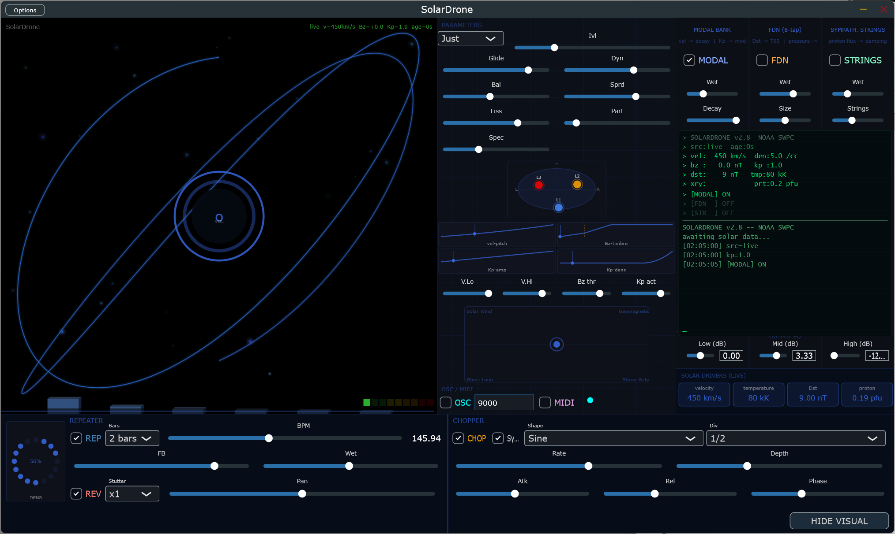

<p align="center">
  
</p>

<h1 align="center">SolarDrone</h1>

<p align="center">
  <strong>real-time space weather → sound</strong>
</p>

<p align="center">
  <a href="https://github.com/dobidu/solardrone/releases/latest"></a>
  <a href="https://github.com/dobidu/solardrone/commits/main"></a>
  <a href="LICENSE"></a>
</p>

<p align="center">
  <a href="#what-it-does">What it does</a> •
  <a href="#build">Build</a> •
  <a href="#controls">Controls</a> •
  <a href="#architecture">Architecture</a> •
  <a href="#release-history">Releases</a>
</p>

---

<p align="center">
  
</p>

---

A standalone app and JUCE plugin (VST3, AU) that sonifies real-time space weather data from NOAA SWPC as a two-layer additive drone with animated visual and resonator engine.

Solar wind parameters (velocity, density, Bz, temperature) drive Layer 1; the Kp planetary index drives Layer 2. Three parallel resonator modules (modal bank, feedback delay network, sympathetic strings) are continuously driven by live solar data. The drone evolves in real time as space weather changes.

Educational tool and material for audiovisual installation.

## What it does

SolarDrone fetches five live feeds from NOAA SWPC every 60 seconds:

| Feed | Data |
|------|------|
| `rtsw_wind_1m.json` | Solar wind velocity, density, Bz, temperature |
| `planetary_k_index_1m.json` | Kp geomagnetic index (0–9) |
| `xrays-1-minute.json` | X-ray flux + flare classification |
| `kyoto-dst.json` | Dst storm index (nT) |
| `integral-protons-1-day.json` | Proton flux >10 MeV (pfu) |

These drive a two-layer additive oscillator bank with configurable glide, a three-layer visual renderer (Lissajous curves, particle field, spectral bars), and a resonator engine that applies room/string/modal coloration to the drone.

Quiet solar conditions produce a sparse, open drone. Geomagnetic storms (Kp ≥ 6, southward Bz) produce dense, tense harmonic texture. A large proton event injects noise into the sympathetic strings.

A **SolarTerminal** hacking console displays live solar data, resonator state, and an event log (Kp jumps, storm onsets, SEP events) in the resonator panel.

## Requirements

| Dependency | Version |
|------------|---------|
| C++ compiler | C++17 (GCC 11+, Clang 13+, MSVC 2022+) |
| CMake | 3.22+ |
| Linux | libcurl4-openssl-dev + X11/ALSA/WebKit packages (see below) |
| macOS | Xcode 14+ |
| Windows | Visual Studio 2022 or MSYS2/MinGW |

## Build

```bash
cmake -B build -DCMAKE_BUILD_TYPE=Release
cmake --build build
```

**First build**: ~5–10 minutes — JUCE 8 is fetched via CMake FetchContent (~140 MB) and compiled.  
**Subsequent builds**: ~30 seconds (incremental).

### Linux system dependencies

```bash
sudo apt-get install -y \
  libasound2-dev libfreetype6-dev libx11-dev libxcomposite-dev \
  libxext-dev libxinerama-dev libxrandr-dev libxrender-dev \
  libglu1-mesa-dev mesa-common-dev libwebkit2gtk-4.1-dev \
  libcurl4-openssl-dev
```

### Targets built

| Target | Platforms |
|--------|-----------|
| Standalone app | Windows, macOS, Linux |
| VST3 plugin | Windows, macOS, Linux |
| AU plugin | macOS only |
| Unit test binary | All |

## Quick Start — Standalone

```bash
# Linux
./build/SolarDrone_artefacts/Release/Standalone/SolarDrone

# macOS
open build/SolarDrone_artefacts/Release/Standalone/SolarDrone.app

# Windows (PowerShell)
.\build\Release\SolarDrone_artefacts\Standalone\SolarDrone.exe
```

> **Windows — build from source required**: Windows Smart App Control blocks unsigned binaries downloaded from the internet. Build locally:
> ```cmd
> git config --global --add safe.directory *
> cmake -B build -DCMAKE_BUILD_TYPE=Release
> cmake --build build --config Release
> .\build\SolarDrone_artefacts\Release\Standalone\SolarDrone.exe
> ```

The app opens a **1350×780** window: visual (left 660px), parameters (centre 360px), resonators (right 330px). Click **HIDE VISUAL** (bottom-right) to collapse to **690×890** — parameters and resonators only, Repeater/Chopper stacked.

After ~30 seconds the status overlay changes from `default` to `live  Kp X.X  age 0s` (green). The drone shifts to reflect actual solar wind conditions.

## Plugin Install

**VST3** — copy `build/.../SolarDrone.vst3` to your VST3 folder:
- Linux: `~/.vst3/`
- macOS: `~/Library/Audio/Plug-Ins/VST3/`
- Windows: `C:\Program Files\Common Files\VST3\`

**AU (macOS only)** — copy `build/.../SolarDrone.component` to `~/Library/Audio/Plug-Ins/Components/`

## Controls

All parameters are automatable via DAW (APVTS).

### Main

| Parameter | Range | Default | Description |
|-----------|-------|---------|-------------|
| Volume | 0–1 | 0.7 | Master output level |
| Drone On | on/off | on | Silences output immediately |
| Glide Time | 30–300 s | 120 s | Interpolation speed between data updates |
| Dynamics | 0–1 | 1.0 | Scales L2 amplitude excursion |
| Layer Balance | 0–1 | 0.5 | 0 = L1 (solar wind), 1 = L2 (Kp) |
| Stereo Spread | 0–1 | 0.5 | Stereo width between layers |
| Harmony Mode | Just / Equal | Just | Interval tuning system |
| L1/L2 Interval | 0–12 semitones | 7 | Interval between L1 and L2 fundamentals |
| Visual Lissajous | 0–1 | 0.7 | Lissajous curve layer blend |
| Visual Particles | 0–1 | 0.7 | Particle field layer blend |
| Visual Spectral | 0–1 | 0.7 | Spectral bar layer blend |

### Beat Repeater (bottom strip, left)

| Parameter | Range | Default | Description |
|-----------|-------|---------|-------------|
| Repeater On | on/off | off | Enables stutter loop |
| BPM | 30–300 | 120 | Loop rate (or lock to MIDI clock) |
| Bars | 1/16–2 | 1/4 | Loop length |
| Feedback | 0–1 | 0.5 | Loop decay |
| Wet | 0–1 | 0.5 | Wet/dry mix |
| Reverse | on/off | off | Play loop buffer backwards |
| Stutter | x1/x2/x4/x8 | x1 | Subdivide loop into shorter segments |
| Pan | -1 → +1 | 0 | Constant-power wet stereo pan |

### Chopper (bottom strip, right)

| Parameter | Range | Default | Description |
|-----------|-------|---------|-------------|
| Chopper On | on/off | off | Enables rhythmic gate |
| BPM Sync | on/off | on | Syncs to Repeater BPM / MIDI clock |
| Shape | sine/square/saw | square | Gate envelope shape |
| Division | 1/16–1 | 1/8 | Gate rate |
| Rate | 0.1–20 Hz | 4 Hz | Free rate when sync off |
| Depth | 0–1 | 0.8 | Gate depth |
| Attack | 0–1 | 0.05 | Gate rise time (fraction of half-period) |
| Release | 0–1 | 0.05 | Gate fall time |
| Phase | 0–360° | 0 | LFO phase offset relative to beat |

### Resonator Engine (right panel)

| Parameter | Range | Default | Description |
|-----------|-------|---------|-------------|
| Modal On | on/off | off | Enable modal bank |
| Modal Wet | 0–1 | 0.3 | Modal bank wet level |
| Modal Decay | 0–1 | 0.5 | Base decay time (solar vel scales this) |
| FDN On | on/off | off | Enable feedback delay network |
| FDN Wet | 0–1 | 0.3 | FDN wet level |
| FDN Size | 0–1 | 0.5 | Room size (Dst scales T60) |
| Strings On | on/off | off | Enable sympathetic strings |
| Strings Wet | 0–1 | 0.3 | Strings wet level |
| Strings N | 0–1 | 0.5 | Number of active strings |

### OSC / MIDI CC Output

| Control | Description |
|---------|-------------|
| OSC Enable | Streams solar data to UDP port (default 9000) |
| OSC Port | UDP port (text field, default 9000) |
| MIDI CC | Sends Kp/velocity/Bz as CC 20/21/22 on ch 1 |

Outputs are sent every 100ms (10fps) on the message thread.

## Architecture

```
DataFetcher (5 NOAA feeds, 60s poll)
    │
    ▼
SpaceWeatherState  ──────────────────────────────────────────────┐
    │                                                             │
    ▼                                                             ▼
SynthParamMapper                                         ResonatorEngine
(hybrid linear+nonlinear)                      ┌─────────────────────────────┐
    │                                          │ ModalBank (32 IIR bandpass) │
    ▼                                          │ FDN (8-tap Hadamard)        │
Interpolator (exponential slew, ~100Hz)        │ SympatheticStrings (12 comb)│
    │                                          └─────────────────────────────┘
    ▼                                                             │
AdditiveEngine (L1 solar wind + L2 Kp)  ──────────────────────▶ mix
    │
    ▼
BeatRepeater → Chopper → OutputEQ (3-band) → audio out
    │
    ▼
VisualRenderer (30fps: Lissajous 3D + particles + spectral)
```

### Resonator solar data mappings

| Solar input | Resonator | Effect |
|-------------|-----------|--------|
| Wind velocity | Modal Bank | decay time (fast wind = shorter decay) |
| Kp index | Modal Bank | mode count + inharmonicity |
| Dst index | FDN | T60 reverb time (storm = longer tail) |
| Dynamic pressure (vel × density) | FDN | absorption cutoff frequency |
| Proton flux >10 MeV | Strings | damping + noise injection |

## Running Tests

```bash
cmake --build build --target SolarDrone_Tests
# Linux / macOS
./build/SolarDrone_Tests_artefacts/Release/SolarDroneTests
# Windows
.\build\Release\SolarDrone_Tests_artefacts\SolarDroneTests.exe
```

20 unit tests: DataFetcher parsers (quiet day, storm day, null fields, temperature, Dst, proton flux), SynthParamMapper (mapping values, determinism, harmony modes).

## Known Limitations

**HTTP sandbox in Logic Pro / Pro Tools**: these hosts block outbound HTTP. SolarDrone falls back to last known state (`source = "cached"`, displayed in yellow).

**First fetch latency**: NOAA data arrives ~30 seconds after cold start. Default values play until first successful fetch (velocity = 450 km/s, Kp = 0).

**ALSA warnings on Linux/WSL2**: `open /dev/snd/seq failed` messages are non-fatal.

**Windows Smart App Control**: blocks unsigned downloaded binaries. Build from source (see Quick Start).

**AU code signing (macOS)**: unsigned AU builds require Gatekeeper disabled or Apple Developer ID. Use VST3 for development.

**Drone on/off**: silences immediately (no fade). Glide-out fade deferred to a future version.

**Real-time data only**: historical playback not implemented.

## Data Sources

[NOAA Space Weather Prediction Center](https://www.swpc.noaa.gov/) — public JSON API, no authentication.

| Feed | URL |
|------|-----|
| Solar wind | `https://services.swpc.noaa.gov/json/rtsw/rtsw_wind_1m.json` |
| Kp index | `https://services.swpc.noaa.gov/json/planetary_k_index_1m.json` |
| X-ray flux | `https://services.swpc.noaa.gov/json/goes/primary/xrays-1-minute.json` |
| Dst index | `https://services.swpc.noaa.gov/products/kyoto-dst.json` |
| Proton flux | `https://services.swpc.noaa.gov/json/goes/primary/integral-protons-1-day.json` |

## Release History

| Version | Date | Highlights |
|---------|------|-----------|
| v2.9.1 | 2026-06-01 | Terminal live update fix (resonator toggles now logged instantly) |
| v2.9.0 | 2026-06-01 | SolarTerminal console, REP/CHOP 6 new params, UI audit |
| v2.8.0 | 2026-06-01 | Resonator Engine (modal/FDN/strings), 3-column layout, HIDE VISUAL |
| v2.7.0 | 2026-05-31 | Visual Overhaul 2: 3D Lissajous, bloom, 200+ particles |
| v2.6.0 | 2026-05-31 | OSC + MIDI CC output |
| v2.5.0 | 2026-05-31 | Binaural ILD, 3-band EQ, crackling fix |
| v2.4.0 | 2026-05-31 | X-ray flux → L3 burst layer |
| v2.3.0 | 2026-05-31 | Mapping UI with editable thresholds |
| v2.2.0 | 2026-05-30 | UI/UX overhaul (SunDisc, MacroOrb, spatial display) |
| v2.1.0 | 2026-05-30 | BeatRepeater + Chopper with MIDI clock sync |
| v1.0.0 | 2026-05-29 | Initial release |

## License

SolarDrone source code: **MIT**.  
JUCE framework: **GPL v3** (Community Edition). Distributing binaries requires either open-source release under GPL or a [JUCE commercial license](https://juce.com/get-juce/).  
VST3 SDK: Steinberg VST3 License.
